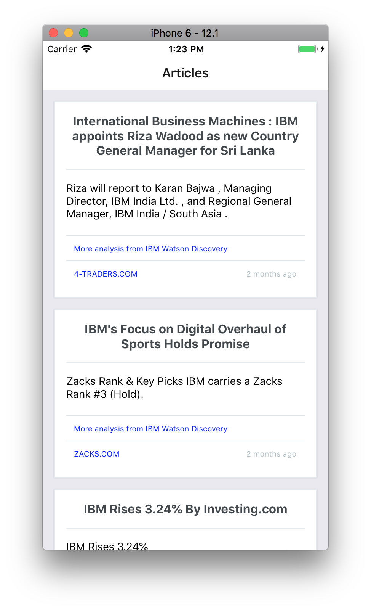
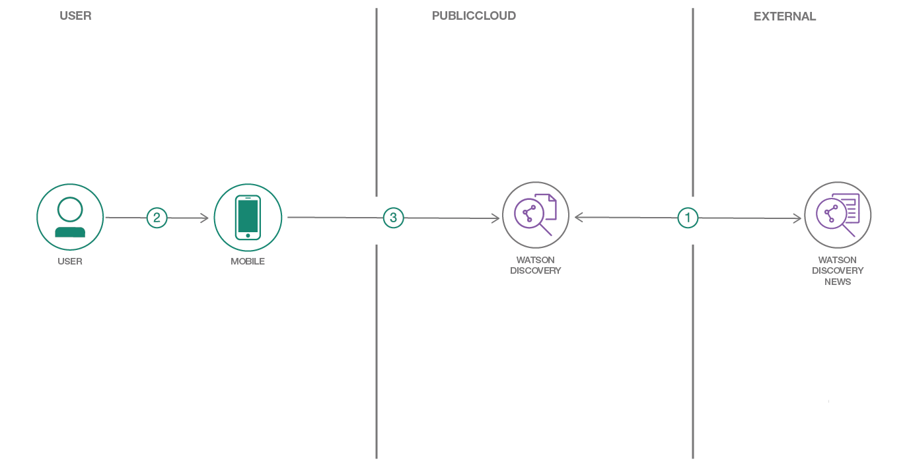
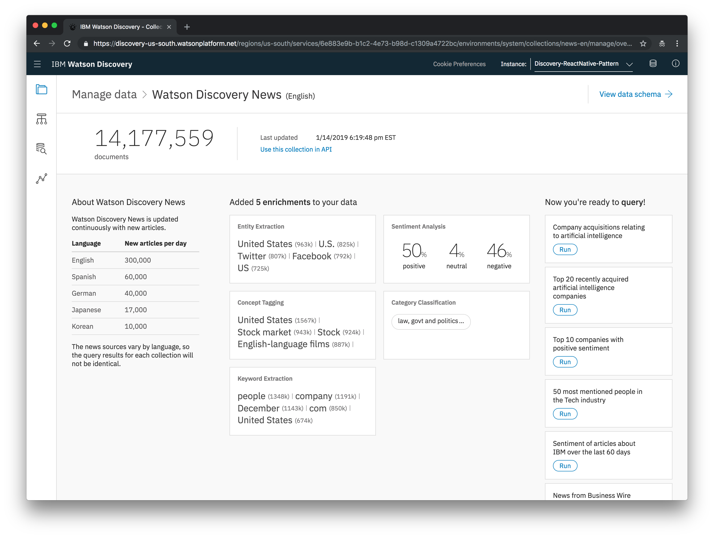

[](https://travis-ci.org/IBM/build-react-native-app-for-watson-discovery)

# Build a cross-platform mobile app to search company news and gain insights

Work in progress!!!

Get started building a cross-platform mobile app using React Native to fetch news on a company and gain insights using Watson Discovery.

Create a cross-platform mobile app that fetches news for a specific company. The application uses Watson Discovery to get news articles with sentiment, keywords, and related concepts. This application is easily customizable and provides a starting point to use Watson Discovery in your own React Native applications.

Following completion of this pattern, the developer will understand how to:

* Create a cross-platform mobile application using React Native
* Use Watson Discovery to detect sentiment and keywords for articles
* Use Watson Discovery to find additional, related news articles for each associated keyword

|   |   |
| - | - |
|  |  |



## Flow

1. Watson News data is loaded into the Watson Discovery service collection.
1. The user interacts with the Watson Discovery service via the React Native mobile app UI running in the XCode iOS Simulator.
1. The initial load of the mobile app will pull up recent, relevant articles for a company. The user can then click on insights to get sentiment, keywords, and concepts from Discovery for any specific article.

## Included components

* [IBM Watson Discovery](https://www.ibm.com/watson/developercloud/discovery.html): A cognitive search and content analytics engine for applications to identify patterns, trends, and actionable insights. Extract meta-data from returned content such as concepts, keywords, and sentiment using natural language understanding.

## Featured technologies

* [React Native](https://facebook.github.io/react-native/): React Native lets you build mobile apps using only JavaScript. It uses the same design as [React](https://reactjs.org/), letting you compose a rich mobile UI from declarative components.

# Watch the Video

TBD

# Steps

> NOTE: This app requires that the following steps be performed on a Mac running the latest iOS version.

1. [Clone the repo](#1-clone-the-repo)
1. [Create IBM Cloud services](#2-create-ibm-cloud-services)
1. [Configure credentials](#3-configure-credentials)
1. [Run the application](#4-run-the-application)

## 1. Clone the repo

```bash
git clone https://github.ibm.com/IBM/build-react-native-app-for-watson-discovery
cd build-react-native-app-for-watson-discovery
```

Note that all of the `react-native` assets can be found in the `ReactNativeCodePattern` sub-directory. Set that as your current directory before executing the remaining steps.

```bash
cd ReactNativeCodePattern
```

## 2. Create IBM Cloud services

* [**Watson Discovery**](https://cloud.ibm.com/catalog/services/discovery)

## 3. Configure credentials

Launch the **Watson Discovery** tool. The credentials for the service can be found by selecting the `Service Credentials` tab.

If no credentials exist, select the `New Credential` button to create a new set of credentials.

In the `Globals.js` file, add the `apikey` value to the `WATSON_DISCOVERY_CREDENTIAL` key using the following format: `apikey:<your api key>`.

## 4. Run the application

The `Node` app must be run using the XCode iOS Simulator.

* Install [Node.js](https://nodejs.org/en/) runtime or NPM.
* Install [Xcode](https://developer.apple.com/xcode/) using the `App Store` on your Mac.

Build and run the app using the following commands:

```bash
npm install
react-native run-ios
```

The `react-native run-ios` command launches the application on the `iOS Simulator`. If not already running, this command will launch the simulator using the last device settings.

## 5. Run the application on a device (optional)
After the application is running in the iOS simulator, you can test on an actual device. The React Native official documentation provides a [step by step guide](https://facebook.github.io/react-native/docs/running-on-device) to running an app on iOS devices.

## 6. View the Watson Discovery dashboard (optional)
As an optional step, you can explore the data in Watson Discovery News that is being fetched in the React Native application.



# Links

* [Watson Discovery Getting Started Tutorial](https://console.bluemix.net/docs/services/discovery/getting-started.html#getting-started-tutorial)
* [Watson Discovery API docs](https://console.bluemix.net/apidocs/discovery)

# Learn more

* **Artificial Intelligence Code Patterns**: Enjoyed this Code Pattern? Check out our other [AI Code Patterns](https://developer.ibm.com/technologies/artificial-intelligence/)
* **AI and Data Code Pattern Playlist**: Bookmark our [playlist](https://www.youtube.com/playlist?list=PLzUbsvIyrNfknNewObx5N7uGZ5FKH0Fde) with all of our Code Pattern videos
* **With Watson**: Want to take your Watson app to the next level? Looking to utilize Watson Brand assets? [Join the With Watson program](https://www.ibm.com/watson/with-watson/) to leverage exclusive brand, marketing, and tech resources to amplify and accelerate your Watson embedded commercial solution.

# License

This code pattern is licensed under the Apache Software License, Version 2.  Separate third party code objects invoked within this code pattern are licensed by their respective providers pursuant to their own separate licenses. Contributions are subject to the [Developer Certificate of Origin, Version 1.1 (DCO)](https://developercertificate.org/) and the [Apache Software License, Version 2](https://www.apache.org/licenses/LICENSE-2.0.txt).

[Apache Software License (ASL) FAQ](https://www.apache.org/foundation/license-faq.html#WhatDoesItMEAN)
